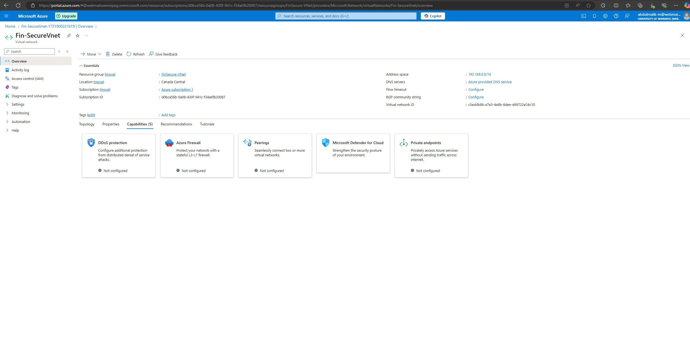
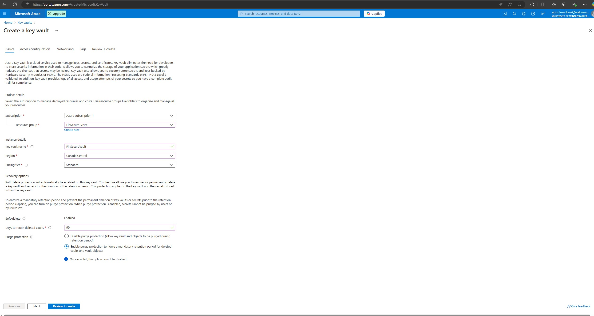
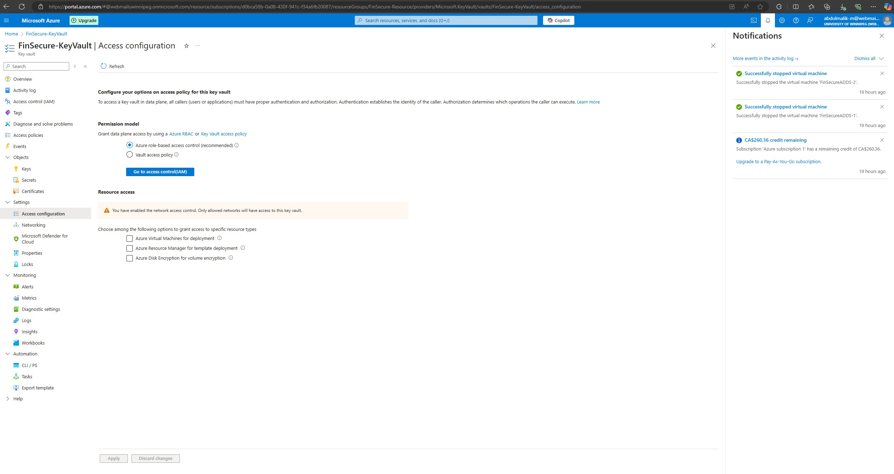
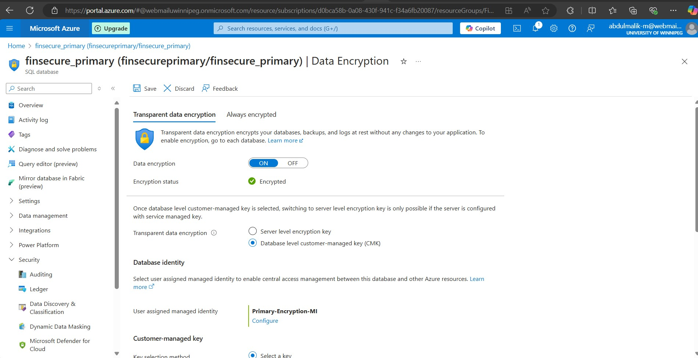
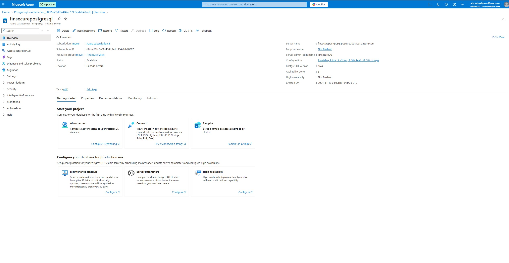
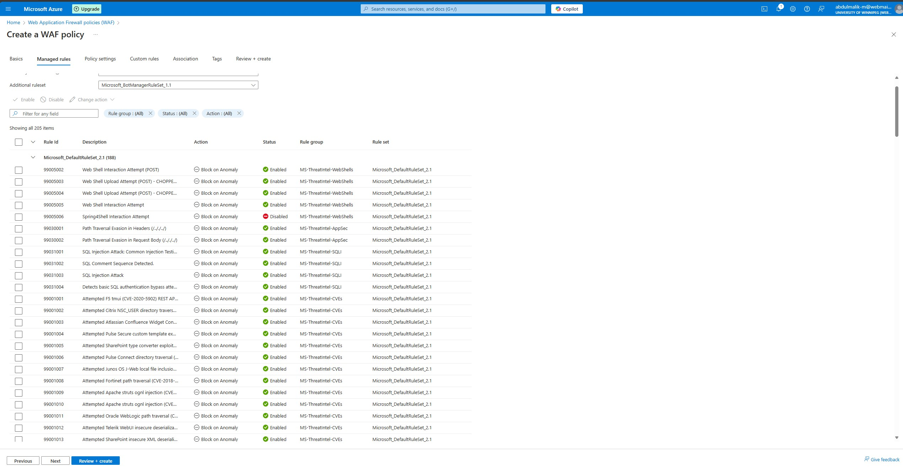

# Reference Notes — Cloud Migration Module

> **Supplementary material.** This is a lightly cleaned summary of the group's Cloud Migration module working notes, not a rewritten standalone report like the [flagship report](../report/full-report.md). It's included for completeness and context.

## Objective

Migrate FinSecure Technologies Inc.'s on-premises infrastructure — Active Directory, web servers, PostgreSQL databases, SFTP servers, and Redis cache — to Microsoft Azure, without breaking SOX/PCI-DSS/GLBA compliance during or after the move.

## Key Work Completed

- **Secure cloud infrastructure setup** — Azure Virtual Network (VNet) with segregated public/private subnets, Azure Active Directory for identity, Azure Firewall and Network Security Groups (NSGs) for traffic control, and Azure Security Center for continuous threat monitoring.
- **Database security** — Transparent Data Encryption (TDE) on the Azure PostgreSQL Flexible Server to protect data at rest (encrypts data files, backups, and logs automatically, with minimal application-side changes), plus database auditing, activity monitoring, and firewall rules restricting access.
- **Key management** — Azure Key Vault used for TDE key management and secrets, with network access rules (private endpoint / selected-network) restricting who can reach the vault.
- **PCI DSS-specific controls** — Cardholder Data Environment (CDE) segmented within Azure networking; cardholder data encrypted both across public networks and within Azure; two-factor authentication required for any access to CDE systems; regular vulnerability scanning of Azure resources.
- **Application/web layer** — Web Application Firewall in front of the migrated web tier, current TLS certificates, and a regular patch cadence for web servers and applications.
- **Monitoring and incident response** — Azure Security Center as the continuous monitoring backbone, with a cloud-specific incident response plan and recurring employee security-awareness training.

## Evidence: The Actual Azure Deployment

These are screenshots from the group's own Azure subscription, not mockups — the resource names (`Fin-SecureVnet`, `FinSecureVault`, `finsecurepostgresql`) are the actual deployed resources built for this project.

*Fin-SecureVnet in Canada Central, with DDoS protection, Azure Firewall, and Microsoft Defender for Cloud available as configurable capabilities on the network.*

*Provisioning FinSecureVault in the FinSecure-VNet resource group, with soft-delete and purge protection enabled by default.*

*FinSecure-KeyVault configured to use Azure role-based access control rather than legacy vault access policies — the same least-privilege principle applied network-wide in the [Zero Trust rollout](../report/05-zero-trust-architecture.md).*

*Transparent Data Encryption turned on for the `finsecure_primary` SQL database, using a database-level customer-managed key rather than the server-level default — giving FinSecure direct control over key rotation and revocation.*

*The deployed `finsecurepostgresql` Azure Database for PostgreSQL Flexible Server instance backing the migrated database tier.*

*The Azure WAF policy's managed rule set (Microsoft_DefaultRuleSet_2.1, 205 rules) actively blocking SQL injection, path traversal, and known CVE exploitation attempts — the cloud-side counterpart to the on-prem dual-WAF design in the [network redesign](../report/02-network-design-and-implementation.md).*

## Relationship to the Flagship Report

This module's Azure-specific controls (TDE, Key Vault, NSGs, Azure Security Center) are the cloud implementation of the same principles formalized on-prem in the [network redesign](../report/02-network-design-and-implementation.md) and [Network Security Policy](../policy/network-security-policy.md) — encryption at rest, least-privilege access, continuous monitoring, and PCI-DSS-driven segmentation of cardholder data.
