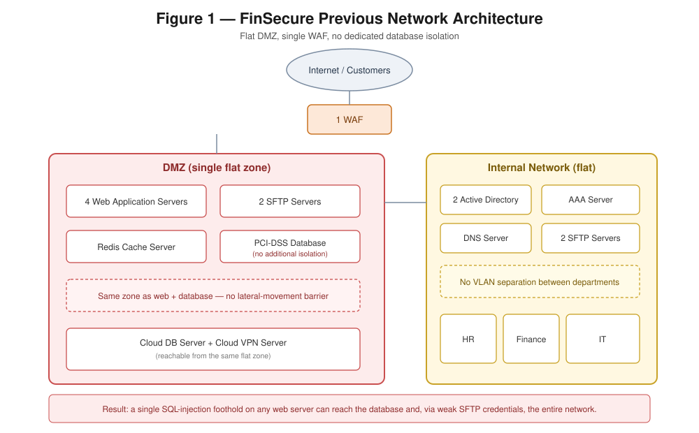
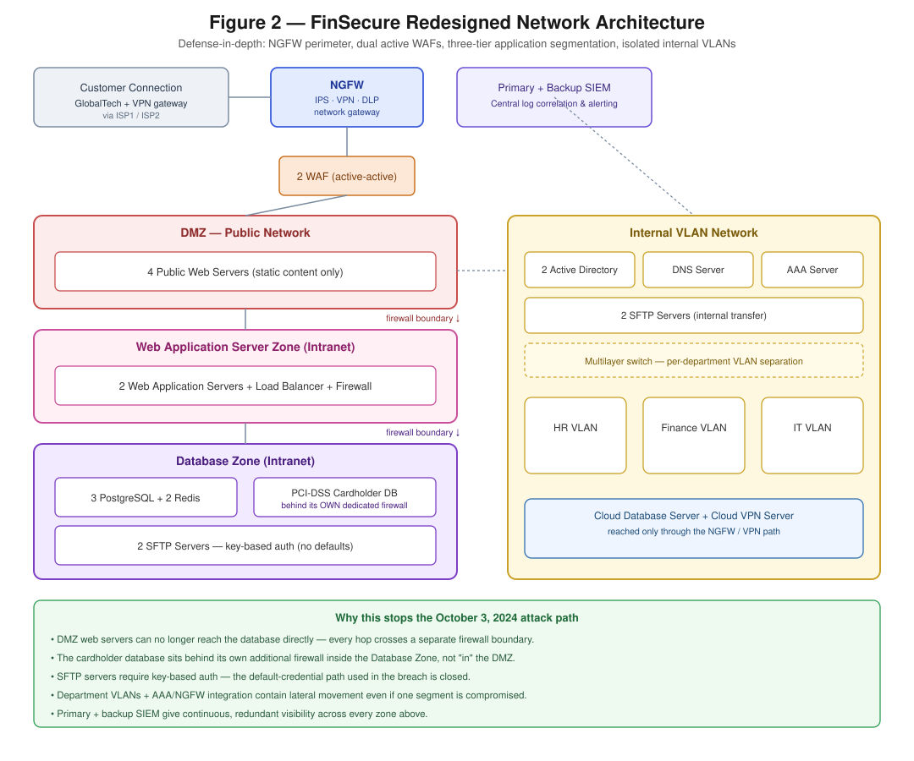
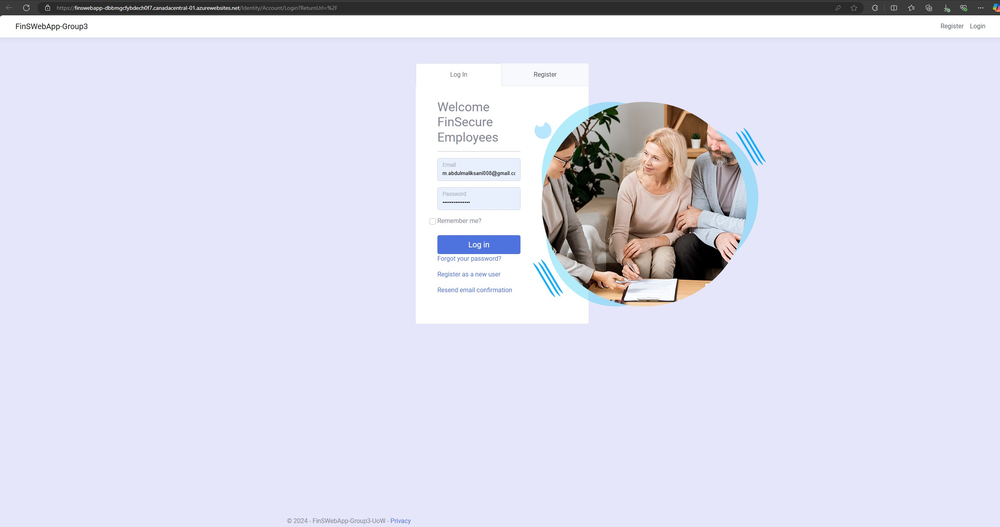
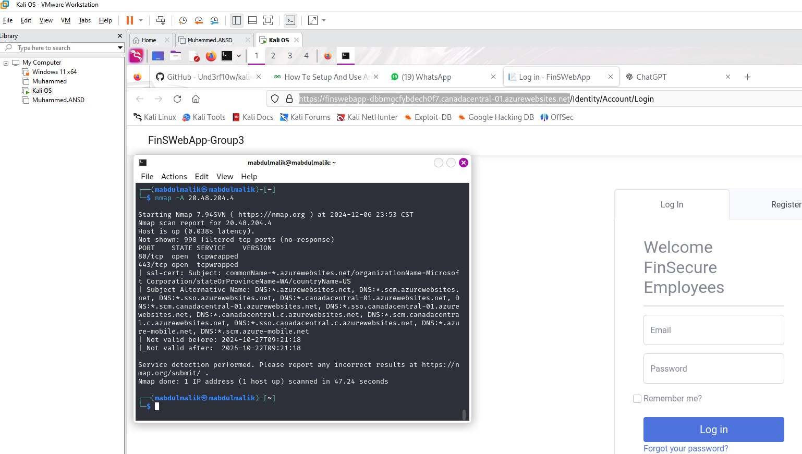
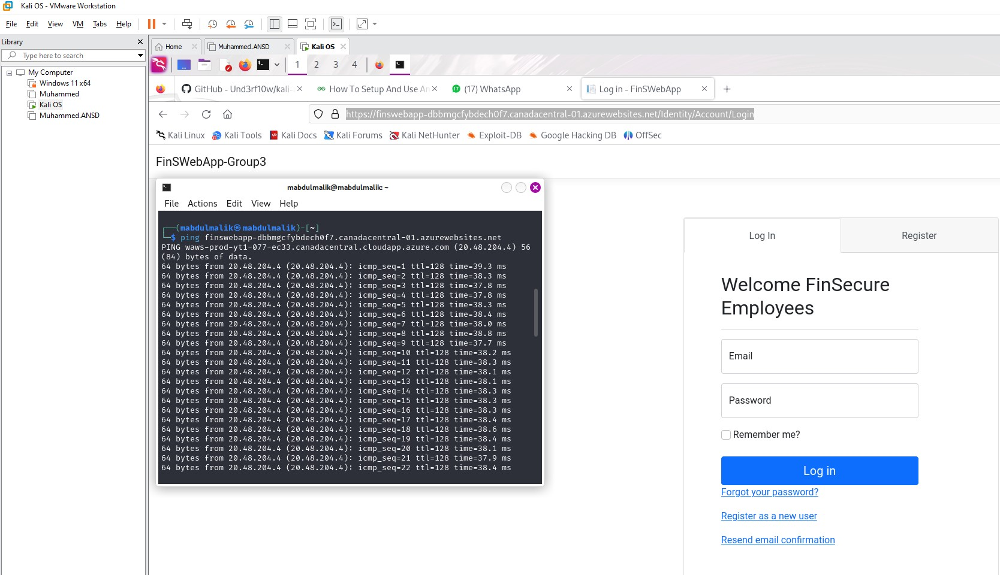
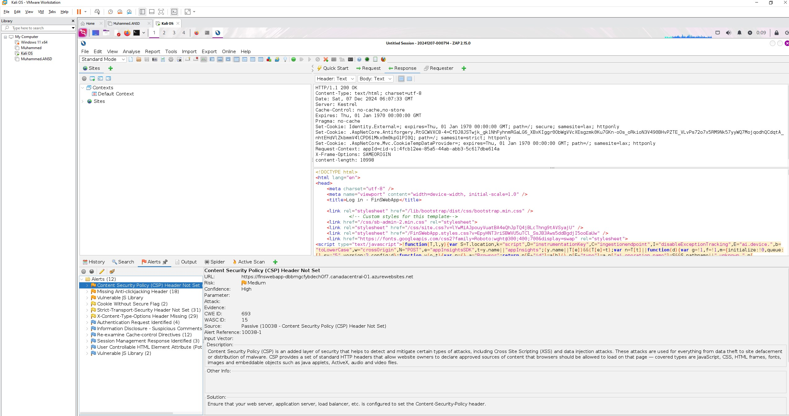
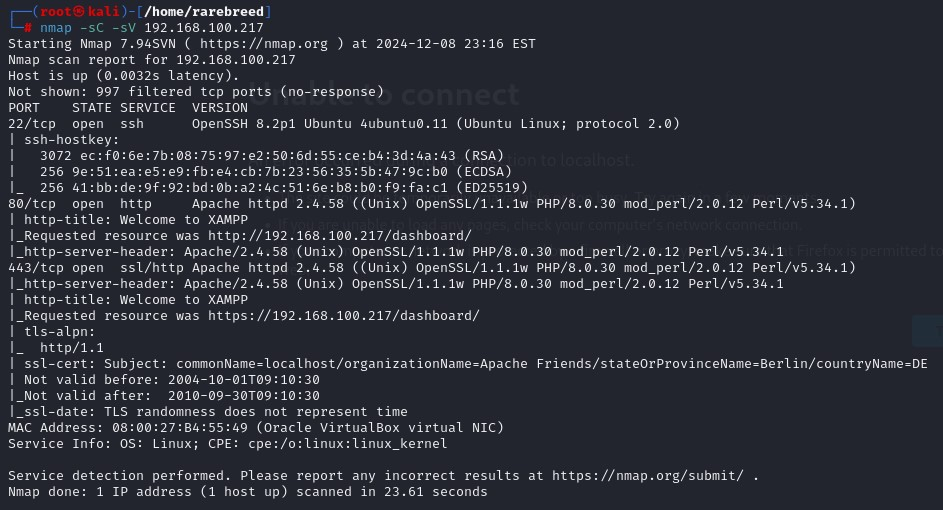
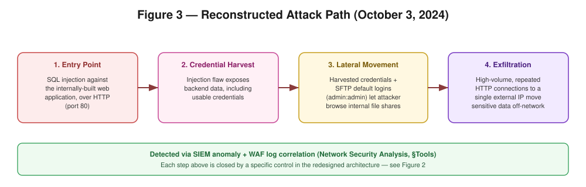
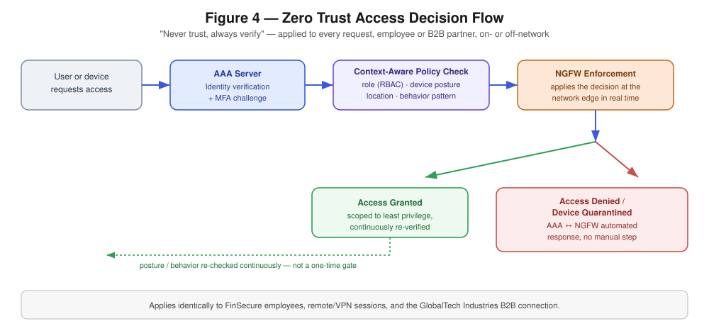

# Fortifying B2B Network Security for Regulatory Compliance

**A Case Study: FinSecure Technologies Inc.**
Group 3 — Case Studies, Issues & Capstone Project in Network Security
University of Winnipeg — Submitted to Victor Balogun — Fall 2024

*Rebuilt edition — see [README](../README.md) for what changed and why.*

---

## Table of Contents

1. [Executive Summary](#executive-summary)
2. [Introduction and Scope](#introduction-and-scope)
3. [Network Design and Implementation](#network-design-and-implementation)
4. [Network Security Analysis](#network-security-analysis)
5. [Risk Assessment](#risk-assessment)
6. [Zero Trust Architecture](#zero-trust-architecture)
7. [Incident Response](#incident-response-application-server-compromise)
8. [Recommendations and Conclusion](#recommendations-and-conclusion)

Appendices: [Network Security Policy](../policy/network-security-policy.md) · [Full Risk Register](../risk-assessment/risk-register.md) · [Diagrams](../diagrams/)

---

<!-- 00-executive-summary.md -->

## Executive Summary

FinSecure Technologies Inc., a New York City-headquartered financial services firm, hosts financial services and software-based web applications for a client base of finance firms, e-commerce companies, government agencies, and publicly traded companies. It does not serve the health sector.

This engagement was commissioned after a confirmed security breach of FinSecure's web application server. The objective was twofold: bring the network into compliance with **SOX**, **PCI DSS**, and **GLBA**, and redesign the environment around **Zero Trust Architecture (ZTA)** principles — with particular attention to securing remote employee access and the B2B connection to FinSecure's key client, GlobalTech Industries.

### Key Outcomes

| Area | Outcome |
|---|---|
| Network architecture | Fully re-segmented into DMZ, Web Application, Database, and Internal VLAN zones, each behind dedicated firewalls |
| Perimeter defense | Dual active-mode Web Application Firewalls (WAF) and a Next-Generation Firewall (NGFW) with IPS, VPN, and DLP |
| Identity & access | New AAA server integrated with Active Directory, delivering SSO, MFA, RBAC, and continuous behavioral monitoring |
| Monitoring | Primary and backup SIEM, with NGFW/WAF logs centralized for correlation and alerting |
| Compliance | Network and policy redesign brings FinSecure into alignment with SOX, PCI DSS, GLBA, and the NIST Cybersecurity Framework |

### Scope

The engagement covered a network security analysis of the compromised environment, a redesigned network architecture, a Zero Trust Architecture implementation, a formal incident response record, a comprehensive risk assessment, and an updated Network Security Policy. Health-sector compliance (e.g., HIPAA) is out of scope — FinSecure has no health-sector clients.

---

<!-- 01-introduction-and-scope.md -->

## Introduction and Scope

### Project Background

FinSecure Technologies Inc. is a financial services firm serving multinational corporations and financial institutions, with GlobalTech Industries as its flagship B2B client. Its infrastructure includes Active Directory servers, public-facing web servers, PostgreSQL database servers, Redis cache servers, and SFTP file-transfer servers.

At the start of this engagement, FinSecure was **not compliant** with SOX, PCI DSS, or GLBA. The immediate trigger was a confirmed breach of the web application server (see [Incident Response](#incident-response-application-server-compromise)), which exposed both the compliance gap and a set of concrete technical weaknesses in the network.

### Scope

1. Assess the existing network and identify the vulnerabilities that enabled the breach.
2. Redesign the network architecture to close those gaps and support ongoing compliance.
3. Procure and integrate the security technology needed to enforce the new design — NGFW, WAF, upgraded AAA/identity infrastructure, and SIEM.
4. Produce a comprehensive risk assessment and a governing Network Security Policy.
5. Design and justify a Zero Trust Architecture, with emphasis on securing remote employee connections and the B2B link to GlobalTech Industries.
6. Deliver staff training materials to support the transition to the new security controls.

### Objectives

- Bring FinSecure into compliance with SOX, PCI DSS, and GLBA.
- Implement Zero Trust principles — "never trust, always verify" — across users, devices, and network segments.
- Formalize a network security policy covering access control, monitoring, incident response, and data handling.

### Out of Scope

- Health-sector compliance frameworks (e.g., HIPAA) — FinSecure has no health-sector clients.
- Physical office relocation or facilities work beyond the data center controls referenced in the Network Security Policy.

---

<!-- 02-network-design-and-implementation.md -->

## Network Design and Implementation

### Previous Architecture

The pre-engagement network (**Figure 1**) had almost no internal segmentation: a single WAF sat in front of the DMZ, and the DMZ itself hosted the public web servers, the web application servers, the SFTP servers, the Redis cache, *and* the PCI-DSS-relevant database side by side. A single flat internal VLAN network held Active Directory, the AAA server, and every department's endpoints together. This flat design is what allowed the October 3, 2024 breach (see [Incident Response](#incident-response-application-server-compromise)) to escalate from a single vulnerable web endpoint into full lateral movement across the network.

*Figure 1 — Previous network architecture: minimal segmentation, single WAF, no dedicated database isolation.*

### Redesigned Architecture

**Figure 2** shows the replacement design. It is built around defense-in-depth: each function-specific zone is isolated behind its own firewall boundary, so a compromise in one zone does not automatically grant access to the next.

*Figure 2 — Redesigned network architecture: NGFW perimeter, dual active WAFs, three-tier application segmentation, and an isolated internal VLAN network.*

#### Network Segments

**Customer Connection.** GlobalTech Industries and other B2B customers connect through a dedicated customer gateway and VPN connection over redundant ISP links, terminating at the NGFW rather than directly at any internal zone.

**Perimeter (NGFW + dual WAF).** A Next-Generation Firewall provides intrusion prevention, VPN termination, and data loss prevention at the network edge. Two Web Application Firewalls run in active-active mode in front of the application zone, giving both redundancy and inspection of all inbound application-layer traffic.

**DMZ.** Four public-facing web servers serve static content and handle the initial customer-facing request. Nothing in the DMZ can reach the database tier directly.

**Web Application Server Zone.** Two web application servers, sitting in a private intranet segment behind a load balancer and firewall, process business logic on behalf of the DMZ web servers. This isolation means a compromised public web server cannot reach application logic or data without crossing another firewall boundary.

**Database Zone.** Three PostgreSQL servers and two Redis cache servers sit in their own private, firewalled segment — a separate tier from both the DMZ and the web application zone, not "inside" either of them. The PostgreSQL instance holding cardholder and other regulated data is isolated behind an **additional**, dedicated firewall within this zone, so a breach of the general database zone still does not expose the PCI-DSS-relevant data. Two SFTP servers used for secure file transfer also live in this zone, now with key-based authentication enforced rather than the default credentials exploited in the original breach.

**Internal VLAN Network.** Employee-facing infrastructure — two Active Directory servers, a secure DNS server, two SFTP servers for internal file transfer, and the AAA server — sits behind a multilayer switch, with HR, Finance, and IT endpoints each on their own VLAN. Segmenting by department limits lateral movement even if one internal VLAN is compromised.

**Monitoring.** A primary and backup SIEM ingest logs from the NGFW, WAFs, and internal infrastructure, giving redundant visibility and satisfying the continuous-monitoring requirements of SOX, PCI DSS, and GLBA.

### Compliance Alignment

- **PCI DSS** — Cardholder data is isolated in the dedicated Database Zone described above, segmented *behind* the DMZ and application tier (not within the DMZ), protected by an additional firewall, and covered by SIEM monitoring.
- **Data privacy (GDPR/CCPA-aligned practices)** — Personal data is segmented by zone, encrypted in transit via VPN, and access is restricted, audited, and controlled through role-based policies.
- **NIST Cybersecurity Framework** — The design maps to the Identify, Protect, Detect, Respond, and Recover functions through asset inventory, segmentation and access control, SIEM-based detection, the incident response process, and backup/disaster recovery planning.

Together, the NGFW, dual WAF, zone segmentation, and SIEM stack establish a secure, compliant baseline — the foundation the Zero Trust Architecture is then built on top of.

---

<!-- 03-network-security-analysis.md -->

## Network Security Analysis

### Methodology

The investigation into the unauthorized access incident combined three complementary approaches so that findings from one method could corroborate another:

1. **Automated network scanning** — broad, repeatable coverage of open ports, exposed services, and known-vulnerable software versions across every server and network device.
2. **Manual penetration testing** — targeted exploitation attempts against the specific weaknesses the automated scans flagged, to confirm they were actually exploitable rather than theoretical.
3. **Security audits** — a policy- and configuration-level review of access controls, encryption, and network segmentation against SOX, PCI DSS, and GLBA requirements.

### Tools and What Each One Found

| Tool | Role | Key finding |
|---|---|---|
| **Nmap** | Port/service discovery, asset mapping | Web servers exposed port 80 (HTTP) with no enforced HTTPS redirect; SSH (port 22) reachable on internal servers, a brute-force risk if credentials are weak. |
| **OWASP ZAP** | Automated vulnerability scanning | Missing security headers (Content-Security-Policy, anti-clickjacking, Strict-Transport-Security), a vulnerable JavaScript library, and cookies issued without the `Secure` flag. |
| **Metasploit** | Exploit verification | Confirmed that the SQL injection flaw in the internally built web application was practically exploitable, not just theoretical — payloads returned real backend data. |
| **Wireshark** | Traffic analysis | High-volume, repeated HTTP connections from the web server to a single external IP — consistent with data exfiltration rather than normal traffic patterns. |
| **Firewall/WAF log review (via SIEM)** | Correlation | A specific web endpoint showed a sustained pattern of SQL injection attempts, corroborating the Metasploit findings and pinpointing the entry point later confirmed in the incident timeline. |
| **Policy & configuration audit** | Compliance review | Several critical servers were not properly segmented, allowing lateral movement between network segments — the same gap closed in the redesigned architecture. |

### Live Reconnaissance and Scanning Evidence

The scans below were run directly against FinSecure's own test deployment (`FinSWebApp`, hosted on Azure App Service) and its pre-production staging server, using the tools listed above from a Kali Linux workstation.

*Figure 3 — The actual target of this assessment: the FinSWebApp login page, the internally developed web application at the center of the incident.*

*Figure 4 — Nmap service scan against the live, Azure-hosted FinSWebApp instance: only ports 80 and 443 are exposed externally, with a valid Azure-issued TLS certificate.*

*Figure 5 — Resolving the FinSWebApp production hostname to its Azure App Service IP address as part of reconnaissance.*

*Figure 6 — OWASP ZAP automated scan results for FinSWebApp: 12 alerts, including a missing Content-Security-Policy header and a vulnerable JavaScript library — the class of gap closed by the WAF and hardened headers in the network redesign.*

*Figure 7 — Nmap scan of the pre-production staging server: SSH (22), HTTP (80), and HTTPS (443) all open, with the HTTPS service presenting a certificate that expired in 2010 — exactly the kind of stale, unmanaged TLS configuration the redesign's certificate and patch-management policy is meant to catch before a server reaches production.*

### Vulnerabilities Discovered

- **SQL Injection** in an internally developed web application, allowing unauthorized access to backend data.
- **Cross-Site Scripting (XSS)** in the same web application, which could allow session hijacking or arbitrary script execution against other users.
- **Weak authentication on SFTP servers** — default credentials (e.g., `admin`/`admin`) left them exposed to brute-force access.
- **Missing security headers and an outdated client-side library**, confirmed by the OWASP ZAP scan above — lower-severity findings, but consistent with the same "hardening was skipped under deadline pressure" pattern that produced the SQL injection flaw.

### Attack Path

*Figure 8 — Reconstructed attack path: SQL injection entry point → credential harvesting → lateral movement to SFTP → data exfiltration.*

1. **Entry point** — SQL injection against the internally developed web application, over HTTP on port 80.
2. **Credential harvesting** — the same injection flaw exposed enough backend information to recover working credentials.
3. **Lateral movement** — those credentials, combined with SFTP servers still using default logins, let the attacker reach and browse file shares beyond the original web application.
4. **Exfiltration** — high-volume, repeated HTTP connections to a single external IP indicated sensitive files being moved off the network.

### Assessment of Current Security Posture (Pre-Remediation)

At the time of the incident, FinSecure's security posture was **moderate at best**, with clear, specific gaps: authentication security, vulnerability management, and internal segmentation. These gaps are addressed directly by the network redesign, the Zero Trust Architecture, and the hardening requirements in the Network Security Policy.

### Recommended Security Solutions

- **Perimeter**: upgrade to an NGFW with integrated VPN, DLP, and IPS to filter and monitor traffic before it reaches internal zones.
- **Application layer**: deploy a WAF to block SQL injection and XSS at the edge, and enforce current TLS certificates on all client-facing communication.
- **Internal segmentation**: implement VLANs per department (HR, Finance, IT) to contain lateral movement.
- **Authentication**: enforce MFA for all users — especially privileged access — require strong, regularly rotated passwords, and eliminate default credentials outright.
- **Training**: run regular security-awareness training focused on phishing prevention, credential hygiene, and incident reporting.
- **Vulnerability management**: schedule recurring OWASP ZAP and Nmap scans and enforce the patch-management SLAs defined in the Network Security Policy.

---

<!-- 04-risk-assessment.md -->

## Risk Assessment

### Methodology

Risk was assessed using a standard threat–vulnerability–impact–likelihood model: for each critical asset, we identified plausible threats, the vulnerabilities that would let those threats materialize, the impact if they did, and how likely that is given current controls. Asset location and strategic importance were also weighted in, so that mitigation effort is directed at the risks that most threaten operational continuity and regulatory compliance — not just the highest raw severity score.

The full asset-by-asset breakdown is maintained separately as a living document: [risk-assessment/risk-register.md](../risk-assessment/risk-register.md).

### Impact Scale

| Level | Definition |
|---|---|
| **Insignificant** | Minor, contained breach; resolved in days with minimal cost; no tangible harm. |
| **Minor** | Breach in one or two areas, resolved in under a week without senior management involvement; slight loss of efficiency, no tangible damage. |
| **Moderate** | Limited, possibly ongoing breach requiring management intervention, up to two weeks to resolve; some compliance cost and indirect reputational effect. |
| **Major** | Systemic breach lasting 4–8 weeks, requiring active senior leadership; customers and the public are likely informed. |
| **Catastrophic** | Breach lasting 3+ months with major customer loss, executive intervention, reputational damage, and possible disciplinary action. |
| **Doomsday** | Multiple severe breaches with indefinite impact — risk of bankruptcy/restructuring, legal action, and inability to meet organizational goals. |

### Likelihood Scale

| Level | Definition |
|---|---|
| **Rare** | Only in exceptional circumstances. |
| **Unlikely** | Could happen, but not expected under current controls. |
| **Possible** | Moderate likelihood; may be hard to control due to external factors. |
| **Likely** | Would not be surprising if it occurred. |
| **Almost Certain** | Expected to occur, likely sooner rather than later. |

### Highest-Priority Risks (Extreme)

| Asset | Threat | Top Control Recommendation |
|---|---|---|
| Customer/financial data | Data breach via SQL injection | Encryption at rest & in transit, strict RBAC, database activity monitoring, admin MFA |
| Security event data (SIEM) | Log tampering, delayed detection | Full log coverage, real-time alerting, IDS/IPS integration, regular tuning |
| User credentials / AD | Privilege escalation, account hijacking | Enforce MFA, least-privilege review, login-attempt auditing |
| Authentication (AAA) | Credential theft, denial of service | Strong password policy, MFA, RADIUS in the backbone, failed-access monitoring |
| Banking service availability | Partial/total service loss | Formal incident response, business continuity and disaster recovery plans, communication matrix with GlobalTech |

Full details — including the High- and Medium-rated risks around firewall configuration, web application attacks, cache/session data, and physical infrastructure — are in the [risk register](../risk-assessment/risk-register.md).

---

<!-- 05-zero-trust-architecture.md -->

## Zero Trust Architecture

### Why Zero Trust, Specifically for FinSecure

None of SOX, PCI DSS, or GLBA mandate "Zero Trust" by name — but each one's actual requirements point directly at it:

| Regulation | Requirement | Zero Trust Principle It Maps To |
|---|---|---|
| **PCI DSS** | Strong access control, least privilege, MFA, network segmentation | Identity verification + micro-segmentation |
| **SOX** | Strong internal controls and protection of financial data from unauthorized access | Continuous identity verification, minimized trust boundaries |
| **GLBA** | Strong protection of nonpublic personal information (NPI) | Least-privilege access model |

Beyond compliance, three practical factors made Zero Trust the right call for FinSecure specifically:

- **Remote and B2B access is the norm, not the exception.** Employees connect remotely and GlobalTech Industries connects as an external partner — a perimeter-only model doesn't fit that reality.
- **Insider risk is a real line item.** As a financial institution handling high-profile client data, the cost of a single over-privileged internal account is disproportionately high.
- **Long-run cost.** The upfront cost of new hardware and specialized staff is real, but it is small next to the cost of another breach, incident response cycle, and compliance remediation like the one that triggered this engagement.

### Implementation Steps

*Figure 9 — Every access request — employee, remote VPN session, or the GlobalTech B2B connection — passes through the same four gates: identity verification, context-aware policy, NGFW enforcement, and continuous re-verification.*

1. **Inventory users, devices, and data flow.** Catalogued every employee, contractor, application, and data repository, and mapped how data actually moves between them — surfacing the segmentation gaps described in the Network Security Analysis.
2. **Define the protected surface.** Identified the Cardholder Data Environment and other critical internal resources (database and web application servers) as the highest-priority protected surface, and enforced micro-segmentation around them — the Database Zone and Web Application Zone described above.
3. **Implement strong Identity and Access Management.** Deployed a new AAA server integrated with Active Directory, delivering Single Sign-On (SSO), Multi-Factor Authentication (MFA), least-privilege access policies, and continuous authentication with behavioral analytics.
4. **Implement monitoring, logging, and automated response.** Added a dedicated SIEM instance for the Cardholder Data Environment alongside the existing SIEM, and integrated the AAA server with the NGFW so that a compromised device's access can be automatically revoked or quarantined without waiting on manual intervention.

### Benefits Realized

- **Reduced blast radius** — the "assume breach" posture, strong auth, and segmentation limit how far any single compromised credential or device can reach.
- **Better user experience despite tighter security** — SSO and context-aware access mean legitimate users authenticate less often, not more, while still tightening the actual control.
- **Faster, more automatic threat containment** — the AAA/NGFW integration quarantines a misbehaving device without a human in the loop for the first response.
- **Clear compliance evidence** — SSO, MFA, and behavioral logging give SOX/PCI/GLBA auditors a direct audit trail of who accessed what, when, and why.

### Challenges and How They Were Handled

| Challenge | How It Was Addressed |
|---|---|
| **Legacy system integration** — much of the existing IPS/IDS infrastructure predated Zero Trust design | Replaced the legacy devices with NGFWs as part of the same rollout rather than trying to retrofit Zero Trust onto them |
| **Cultural resistance to MFA** | Structured change management: training videos, documentation, and self-service tutorials ahead of enforcement |
| **24×7 operational complexity** | Coordinated the rollout across all departments — not just IT — to avoid disrupting live operations |
| **User friction on non-SSO-compliant applications** | Flagged as an ongoing remediation item; prioritized bringing remaining internal apps under the SSO umbrella |

### Cost Considerations

The upfront investment — new NGFW and AAA hardware, plus specialized implementation and ongoing operational staff — was significant. It is justified as a risk-transfer decision: the projected cost of another breach at the scale of the October 3, 2024 incident (client notification, regulatory exposure, reputational damage) is materially larger than the one-time and ongoing cost of the Zero Trust rollout.

---

<!-- 06-incident-response.md -->

## Incident Response: Application Server Compromise

### Incident Overview

**Date:** October 3, 2024
**System affected:** Web application server
**Data exposed:** Cardholder data, including Personally Identifiable Information (PII) and financial records of high-profile clients, including GlobalTech Industries

The breach was first noticed through anomalous entries in the SIEM. Investigation confirmed the attack chain reconstructed above: a SQL injection attack against the web application server over port 80, followed by exploitation of weak SFTP credentials to extract confidential information.

Beyond the immediate data exposure, the incident placed FinSecure in violation of SOX's data-protection requirements — compounding the compliance gap this entire engagement was commissioned to close.

### Response Actions

1. **Containment** — the compromised server was immediately disconnected from the network to stop further exfiltration.
2. **Investigation** — a dedicated incident response team, drawing subject-matter experts from every relevant technical group, conducted a forensic investigation.
3. **Client notification** — affected clients, including GlobalTech Industries, were notified promptly and transparently to preserve trust.
4. **Data recovery and restoration**:
   - Database restored from backup.
   - An additional WAF deployed to prevent recurrence.
   - A dedicated Cardholder Data Environment created, with its own database server behind its own dedicated firewall.
   - A new AAA server with MFA and stricter RBAC introduced.
   - A comprehensive security audit conducted across all systems.
5. **Compliance review** — an independent third-party auditor was engaged to identify any remaining, previously unidentified vulnerabilities.

### Lessons Learned

| Theme | What It Drove |
|---|---|
| **Vulnerability management** | Adoption of a recurring OWASP ZAP / Nmap scanning and patch-management cadence |
| **Incident response planning** | A documented IR plan and a standing, cross-functional response team, rather than an ad hoc response |
| **Continuous monitoring** | SIEM alert thresholds retuned to catch smaller anomalies earlier |
| **Employee training** | General organization-wide security awareness training, plus specialized training for the IT team on distinguishing false positives from real incidents |
| **Regulatory compliance** | Reaffirmed commitment to SOX, PCI DSS, and GLBA, backed by both in-house and third-party audits going forward |

This incident is the direct justification for every major decision in this report: the network redesign, the Zero Trust rollout, and the hardened Network Security Policy all trace back to the specific failure modes exposed here.

---

<!-- 07-recommendations-and-conclusion.md -->

## Recommendations and Conclusion

### Project Recap

This engagement started from a confirmed incident — a SQL injection breach of FinSecure's web application server — and a compliance gap across SOX, PCI DSS, and GLBA. From there, the project assessed the existing (flat, weakly segmented) network and reconstructed exactly how the breach happened; redesigned the network around defense-in-depth zone segmentation, an NGFW, and dual active WAFs; isolated the Cardholder Data Environment behind its own dedicated firewall; rolled out a Zero Trust Architecture with SSO, MFA, RBAC, and context-aware access automatically integrated with the NGFW; added a dedicated SIEM for the Cardholder Data Environment; and formalized all of the above into a governing Network Security Policy and risk register.

Despite real friction — legacy-system integration, cultural resistance to MFA, and the operational complexity of a 24×7 environment — the project delivered a network that is materially more resilient and brings FinSecure into alignment with SOX, PCI DSS, and GLBA.

### Future Recommendations

- **Regular security audits.** Combine in-house reviews with third-party audits on a recurring schedule, not only after an incident.
- **Ongoing training and awareness.** Keep cybersecurity training current for all staff, with role-specific tracks for IT/SOC.
- **Scalability planning.** Every new device or service added to the network must be integrated into the Zero Trust model from day one — Zero Trust degrades quickly if new assets are added outside the framework.
- **Enhanced incident response planning.** Run regular IR drills and feed the lessons from each one back into the plan, rather than only updating it after a real incident.
- **Close the remaining SSO gap.** Bring the non-SSO-compliant internal applications fully into the SSO/MFA umbrella to remove the last source of user friction and shadow risk.

---

*See the [Network Security Policy](../policy/network-security-policy.md) and [Risk Register](../risk-assessment/risk-register.md) for the full supporting appendices.*
